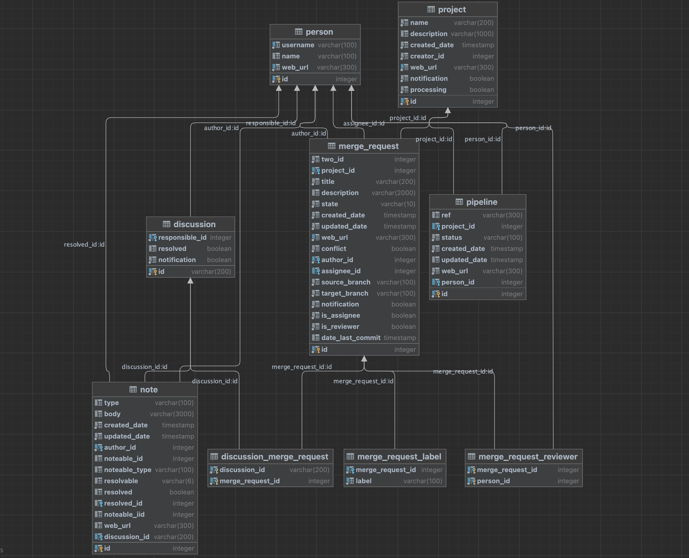

# Общая архитектура

Поддерживается два режима работы: периодические запуски на ПК и запуск на сервере в режиме 24/7.

## Схема БД { id="schema-database" }

Приложение имеет БД, которая используется для сохранения состояния отслеживаемых сущностей GitLab.

<figure markdown>
  { loading=lazy }
  <figcaption>Схема приложения версия 1.0.0</figcaption>
</figure>

Важно подчеркнуть, что приложение не сохраняет все бездумно в БД. Во время первого запуска вам будет задан ряд вопросов, ответы на которые повлияют на наполнение БД.

Также приложение старается не хранить лишние данные. Например, если MR был вмержен или закрыт, то нет смысла хранить информацию об этом MR, поэтому при следующем сканировании запись об этом MR, а также обо всех связанных сущностях этого MR (пайплайны, треды...) будут удалены.

## Сканирование GitLab
Раз в 1 минуту происходит обращение к GitLab API с вашим персональным токеном. Получаемые от GitLab данные сверяются с имеющимися в БД, после чего формируются уведомления, если обнаружены изменения.

!!! question "Почему не использовать Webhook?"

    Не везде имется возможность установить произвольные Webhook. Например, вряд ли кто-то позволит вам установить Webhook из корпоративного GitLab во внешнюю сеть. Переодическое обращение к GitLab API можно выполнять прямо с рабочей машины.

    В будущем планирую добавить поддержку и Webhook.

## Отслеживание репозиториев
Ключевым (рутовым) элементом являются репозитории.