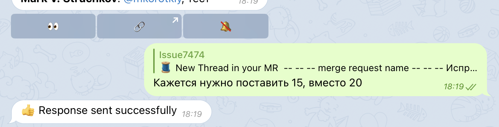
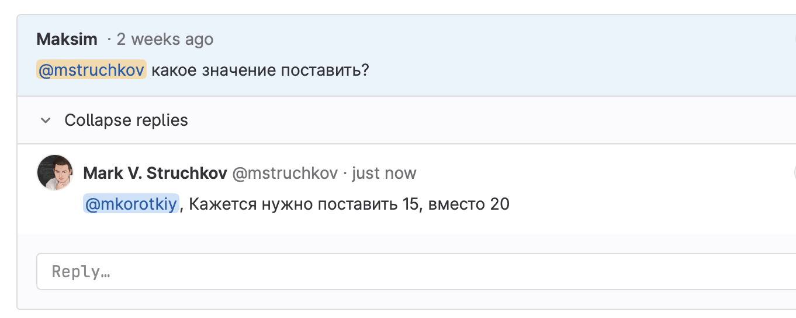

# Взаимодействие с GitLab

Здесь собраны все возможности, которые позволяют вам что-то сделать в GitLab прямо из Telegram.

!!! warning

    Все эти функции работают, если при создании GitLab токена вы указали уровень доступа `api`.

## Ответ в треде
Допустим вас упомянули в обсуждении, сразу знаете что ответить? Не тратьте время, отвечайте прямо из телеграм. Для этого просто ответьте на сообщение и напишите ваш комментарий.

Просто ответьте на сообщение уведомления:

<figure markdown>
  { loading=lazy align=left width="700" }
</figure>

Так это будет выглядеть в GitLab:

<figure markdown>
  { loading=lazy align=left width="700" }
</figure>