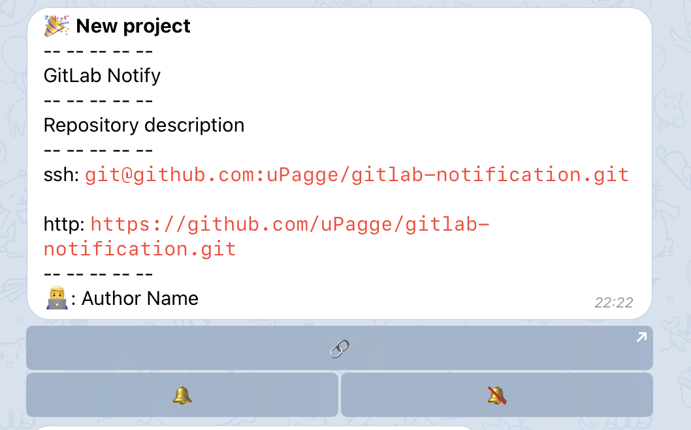
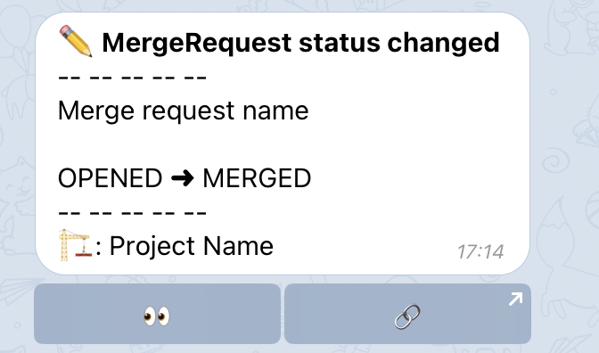
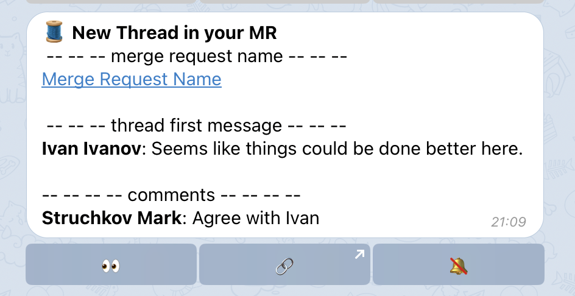
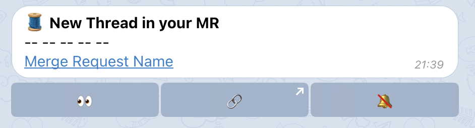
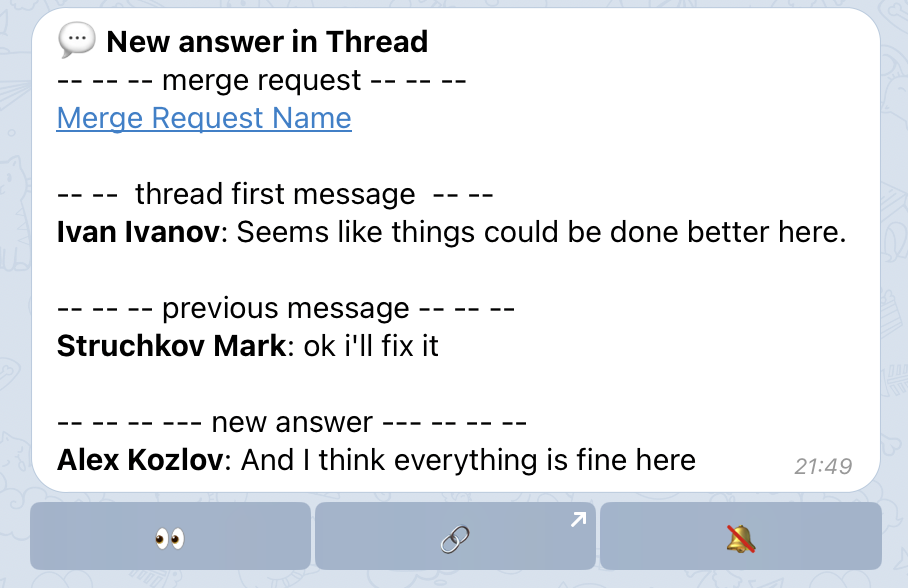
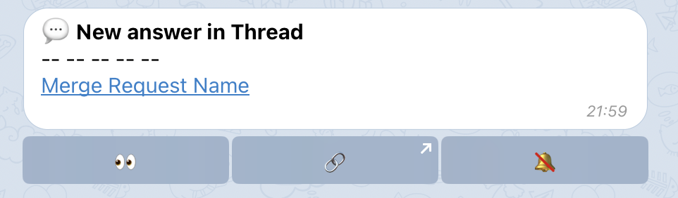
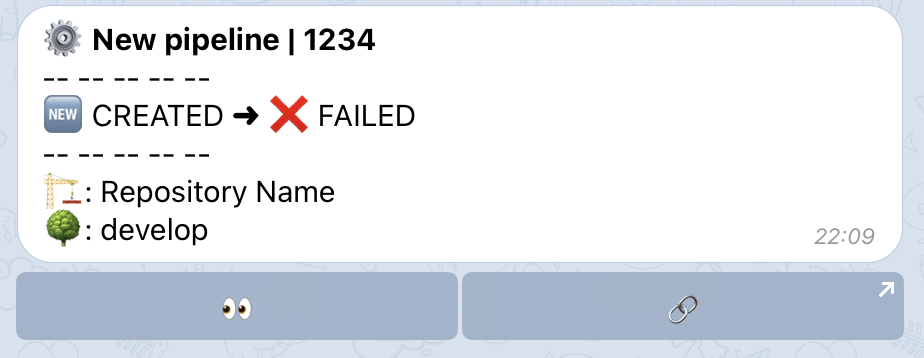

# :bell: Уведомления
Основное предназначение бота - это уведомления от GitLab. Вы будете получать только те уведомления, которые касаются вас непосредственно.

## Новый репозиторий { id="new-repository" }
Если во время первичной настройки вы указали, что хотите получать уведомления о новых репозиториях, то при появлении нового репозитория получите соответствующее уведомление:
<figure markdown>
{ loading=lazy width="500" }
</figure>

Уведомление содержит:

- Project name — название репозитория.
- Project description — описание репозитория. Опционально, может быть пусто.
- Struchkov Mark — имя создателя репозитория в GitLab

Доступно три быстрых действия:

- :link: — ссылка на новый репозиторий в GitLab.
- :bell: — поставить на отслеживание. Вы начнете получать уведомления о событиях в MR, тредах и сборках.
- :no_bell: — не получать уведомления. Используется по умолчанию, по факту просто удаляет сообщение уведомления.

!!! warning ""

    Пока вы явно не нажмете :bell:, вы не будете получать никаких уведомлений. Более того, приложение даже не будет запрашивать MR и прочие сущности репозитория, не будет сохранять их в БД.

## Новый MR { id="new-mr" }
Это уведомление приходит, когда вас назначают ответственным и/или ревьювером. При этом не важно когда это произошло: вас указали при создании MR, или потом заменили кого-то вами. Вы в любом случае получите уведомление.

<figure markdown>
{ loading=lazy width="500" }
</figure>

Уведомление содержит:

- Название MR.
- Описание MR. Опционально.
- Labels. Метки репозитория.
- Имя проекта.
- Ветки откуда куда мержим.
- Автор MR.
- Ответственный/Ревьюверы MR. Заполнение зависит от вашей позиции в этом MR. Если вы ответственный, то вам покажут ревьюверов. Если вы ревьювер, то ответственного.

Доступные быстрые действия:

- :eyes: — прочитано. Удаляет сообщение.
- :link: — ссылка на MR.
- :no_bell: — не получать уведомления по MR.

!!! warning ""

    Учтите, что отключение уведомлений отключает только уведомления об изменениях в MR. Например, обновление статуса MR. Но уведомления по пайплайнам проекта, по тредам MR продолжат приходить.

## Конфликт в MR { id="conflict-mr" }
Если в вашем MR возник конфликт, то вы будете своевременно оповещены. В этом уведомлении указывается название MR, проект и ветка.

<figure markdown>
{ loading=lazy width="500" }
</figure>

Доступные быстрые действия:

- :eyes: — прочитано. Удаляет сообщение.
- :link: — ссылка на MR.
- :no_bell: — не получать уведомления по этому MR.

## Обновление MR { id="update-mr" }
Если в MR, в котором вы являетесь ответственным/ревьювером, добавляются коммиты, вы получаете уведомление.

<figure markdown>
{ loading=lazy width="500" }
</figure>

Уведомление содержит:

- Название MR.
- Отношение количества закрытых тредов к общему количеству созданных тредов.
- Отношение количества закрытых вами созданных тредов к общему количеству созданных вами тредов.
- Название репозитория.
- Имя создателя MR.

Доступные быстрые действия:

- :eyes: — прочитано. Удаляет сообщение.
- :link: — ссылка на MR.
- :no_bell: — не получать уведомления по этому MR.

## Изменение статуса MR
Когда статус вашего MR меняется, вы получаете уведомление.

<figure markdown>
{ loading=lazy width="500" }
</figure>

Доступные быстрые действия:

- :eyes: — прочитано. Удаляет сообщение.
- :link: — ссылка на MR.

## Новый тред в MR
В GitLab можно создавать не просто комментарии, а треды. Если кто-то создаст такое обсуждение в вашем MR, то вы сразу об этом узнаете.

Это уведомление поддерживает уровни конфиденциальности:

1. `WITHOUT_NOTIFY` — уведомления по тредам не отправляются совсем.
2. `NOTIFY_WITHOUT_CONTEXT` — вы получаете уведомление о факте нового треда, но без текста сообщений и отправителей.
3. `NOTIFY_WITHOUT_CONTEXT` — самое подробное уведомление. Содержит текст сообщений и имена отправителей.

=== "NOTIFY_WITH_CONTEXT"

    <figure markdown>
    { loading=lazy width="500" }
    </figure>

    Уведомление содержит:

    - Название MR
    - Первое сообщение треда с автором треда
    - Остальные сообщения треда, если таковые имеются.

=== "NOTIFY_WITHOUT_CONTEXT"

    <figure markdown>
    { loading=lazy width="500" }
    </figure>

    Уведомление содержит:

    - Название MR

Доступные быстрые действия:

- Ответ в GitLab из Telegram.
- :eyes: — прочитано. Удаляет сообщение.
- :link: — ссылка на тред.
- :no_bell: — не получать уведомления по этому треду. Уведомления по другим тредам в это MR продолжат поступать.

## Новое сообщение в треде

Важно оставаться в теме обсуждения, поэтому при появлении новых ответов в тредах, в которых вы участвовали, вы получите уведомление.

Это уведомление поддерживает уровни конфиденциальности:

1. `WITHOUT_NOTIFY` — уведомления по тредам не отправляются совсем.
2. `NOTIFY_WITHOUT_CONTEXT` — вы получаете уведомление о факте нового треда, но без текста сообщений и отправителей.
3. `NOTIFY_WITHOUT_CONTEXT` — самое подробное уведомление. Содержит текст сообщений и имена отправителей.

=== "NOTIFY_WITH_CONTEXT"

    <figure markdown>
    { loading=lazy width="500" }
    </figure>

    Уведомление содержит:

    - Название MR
    - Первое сообщение треда с автором треда
    - Предпоследнее сообщение треда
    - Новое сообщение треда

    !!! tip ""
    
        Такой объем информации должен помочь вам вспомнить/понять контекст обсуждения и ответить прямо из Telegram.

=== "NOTIFY_WITHOUT_CONTEXT"

    <figure markdown>
    { loading=lazy width="500" }
    </figure>

    Уведомление содержит:

    - Название MR

Доступные быстрые действия:

- Ответ в GitLab из Telegram.
- :eyes: — прочитано. Удаляет сообщение.
- :link: — ссылка на тред.
- :no_bell: — не получать уведомления по этому треду. Уведомления по другим тредам в это MR продолжат поступать.

### Упоминание в треде
Допустим, кто-то упомянул вас в MR используя тегирование GitLab (@GitlabLogin). Автор этого MR не вы, ответственным назначали тоже не вас. 

Если вы отслеживаете репозиторий этого MR, но не участвовали в дискуссии, то в этом случае вам придет уведомление. Так вы не пропустите сообщения с вашим упоминанием.

Формат и быстрые действия такие же, как у уведомления "Новое сообщение в треде".

## Уведомление о решенном треде

## Уведомление о пайплайне
Полезно сразу узнавать, что сборка закончилась успешно или упала.

!!! question "Я буду получать уведомление обо всех пайплайнах?"

    Нет. Вы будете получать уведомление только о тех пайплайнах, в которых выступили инициатором. Напримр, запустили CI руками из GitLab, или нажали кнопку Merge в MR.

<figure markdown>
{ loading=lazy width="500" }
</figure>

Уведомление содержит:

- Предыдущий статус пайплайна и новый статус
- Номер пайплайна
- Название репозитория
- Ветка, для которой запускалась сборка

Доступные быстрые действия:

- :eyes: — прочитано. Удаляет сообщение.
- :link: — ссылка на результат работы пайплайна.

