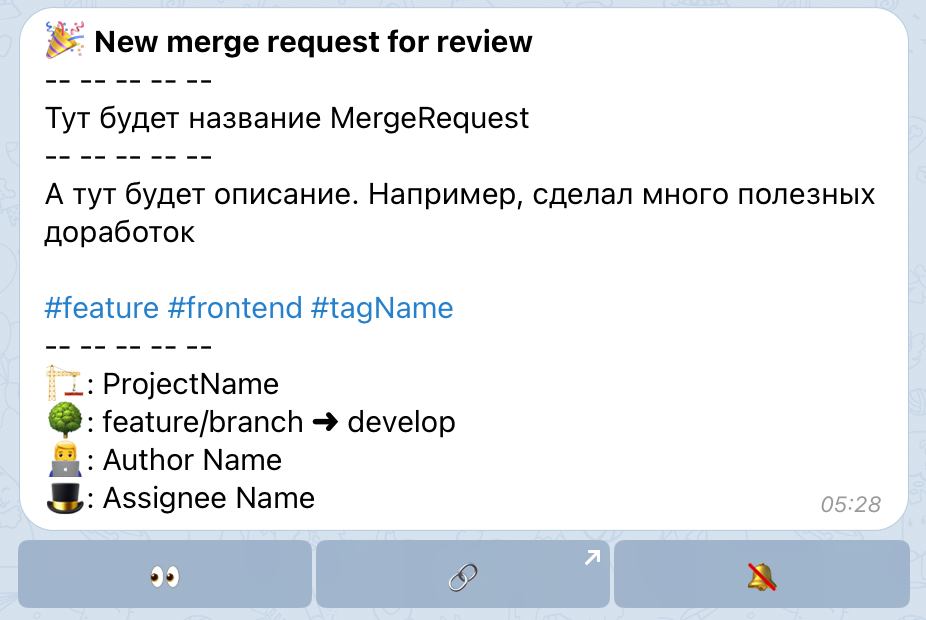
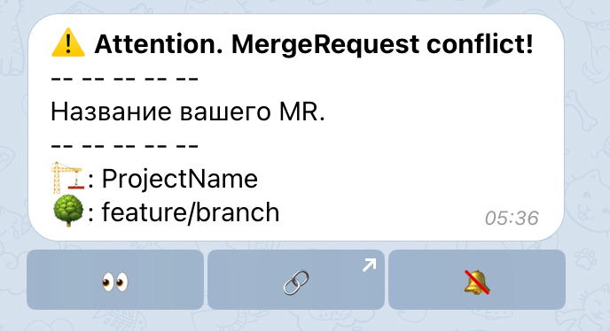
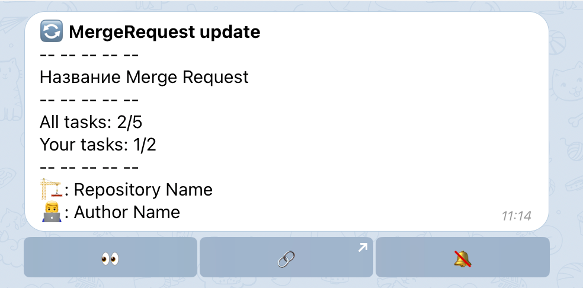

# :bell: Уведомления
Основное предназначение бота - это уведомления от GitLab. Вы будете получать только те уведомления, которые касаются вас непосредственно.

## Новый репозиторий

## Новый MR
Когда кто-то создает MR и назначает вас ответственным и/или ревьювером, то вам приходит уведомление. Из этого уведомления можно узнать название, короткое описание, теги, из какой ветки в какую открыт MR, кто его автор и кто ответственный.
<figure markdown>
{ loading=lazy width="500" }
</figure>

## Конфликт в MR
Если в вашем MR возник конфликт, то вы будете своевременно оповещены. В этом уведомлении указывается название MR, проект и ветка.

<figure markdown>
{ loading=lazy width="500" }
</figure>

## Обновление MR
Когда кто-то делает коммиты в MR, в котором вы ответственный или ревьювер, вам сразу же приходит уведомление. Вы также сразу можете увидеть сколько задач еще не решено, и сколько созданных вами задач не было решено.

<figure markdown>
{ loading=lazy width="500" }
</figure>

## Изменение статуса MR
Когда статус вашего MR меняется, вы получаете уведомление.

## Новый тред в MR
В GitLab можно создавать не просто комментарии, а обсуждения (Discussions). Если кто-то создаст такое обсуждение в вашем MR, то вы сразу об этом узнаете.

## Упоминание в треде
Допустим, кто-то упомянул вас в MR, нужен ваш совет. Автор этого MR не вы, ответственным назначали тоже не вас. Даже в этом случае вам придет уведомление, так вы не пропустите сообщения с вашим упоминанием.

## Ответ в дискусии
Важно оставаться в теме обсуждения, поэтому при появлении новых ответов в дискуссия, в которых вы участвовали, вы получите уведомление.

Оно будет содержать начальное сообщение обсуждения, ваше последнее сообщение в нем, а также два последних комментария. Таким образом вы будете понимать о чем идет речь.