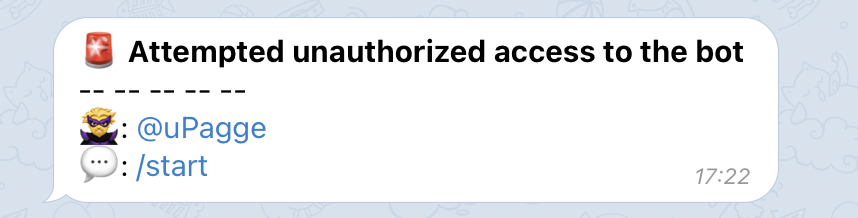

# :ninja:{ .ninja-disappear } Защита данных

Я понимаю, что в GitLab содержится множество конфиденциальной информации, которую не хотелось бы раскрывать. Эта страница пытается ответить на все вопросы, которые могут вас смущать.

## Об авторе бота { id="about-author" }

Давайте знакомится. Меня зовут [Стручков Марк](https://mark.struchkov.dev), я тимлид небольшой команды. В свободное время веду [блог](https://struchkov.dev/blog) и ["блокнот."](https://note.struchkov.dev) ==Это приложение в первую очередь должно помогать мне работать, оптимизируя мое взаимодействие с GitLab.==

В какой-то момент я решил подлиться своими наработками со всеми желающими. И пытаться кому-то что-то доказать у меня нет желания. ==Что-то смущает? Не пользуйтесь.== В этом весь Open Source.

Вы можете [самостоятельно изучить код, он полностью открыт, доступен, и не сложен.](https://github.com/uPagge/gitlab-notification) После проверки можно самостоятельно собрать `jar` и [упаковать его в Docker](https://github.com/uPagge/gitlab-notification/blob/master/Dockerfile). Либо запускать прямо из Idea.

На мой взгляд довольно очевидно, что если бы я преднамеренно замышлял какую-нибудь пакость, то не стал бы делать это от своего имени. Однако некоторые вектора атаки существуют, и я постараюсь описать их на этой странице.

## Защита токена GitLab { id="gitlab-token-protection" }
Для работы ассистента необходим [персональный токен GitLab](../getting-started/create-gitlab-token.md). Достаточно токена с правами только на чтение. Он указывается в [переменные среды](../getting-started/configuration.md#env) и нигде дополнительно не хранится и не передается. Таким образом ==токен не попадает в Telegram, никуда не передается, и хранится только у вас на компьютере и в контейнере приложения.==

==Токен используется только при обращении к указанному GitLab, и только для выполнения описанных в документации возможностей.== Никакой скрытой работы не выполняется, по возможности обо всех взаимодействиях с GitLab дополнительно сообщается в диалоговом режиме, особенно [во время первичной настройки](../getting-started/first-start.md).

!!! question "А что, если ты украдешь токен?"

    Я еще раз повторяю, что в мои планы не входит что-то кому-то доказывать. Это open source, детка, изучайте код и [позорьте мое честное имя](https://mark.struchkov.dev) перед сообществом, если что-то найдете.

    Задайте себе вопрос: насколько полезен токен от вашего корпоративного self-host гитлаба без подключения к корпоративному VPN.

## Уровни конфиденциальности { id="privacy-levels" }

Некоторые уведомления могут содержать множество чувствительной информации. Например, [уведомления о новых сообщениях в тредах.](../features/notify.md#new-thread-answer) Возможно вы не захотите раскрывать столько информации о вашей разработке телеграму, ведь через него идет получение уведомлений. Специально для таких случаев предусмотрены уровни конфиденциальности разных типов уведомлений.

Возьмем для примера уведомление о новом сообщении в треде. При минимальном уровне конфиденциальности вы получите уведомление с текстом комментария и сможете сразу ответить на него в телеграм, а при максимальном уровне конфиденциальности будет сообщаться только о факте нового комментария, без содержания. Все это настраивается при первом запуске.

## Сохранение в БД { id="database" }
Для работы ассистента ему нужно сохранять предыдущее состояние GitLab сущностей. Для этого используется БД. Приложение старается не хранить в БД больше данных, чем необходимо. Как только необходимость в данных теряется, например MR мержится, данные из БД удаляются.

Прочитать подробнее можно в разделе: [Работа с базой данных](../architecture/concept.md#schema-database)

## Несанкционированный доступ { id="access-control" }
==Все боты в Telegram являются публичными.== Это значит, что ваш бот может быть найден через поиск в Telegram. Поэтому ==не рекомендуется давать название боту, которое может раскрыть его предназначение.==

Даже если кто-то случайно напишет вашему боту ничего не случится. ==В боте встроена проверка прав доступа.== Вот как она работает:

1. При запуске вы указываете ваш идентификатор в Telegram. В отличие от логина, идентификатор уникален для каждого пользователя и нет возможности его подменить.
2. Когда бот получает сообщение, он проверяет идентификатор отправителя
3. Если идентификатор отправителя не совпадает с указанным при запуске, бот не обрабатывает команду
4. Вы получаете уведомление о том, что такой-то пользователь пытался написать в ваш бот. Вам доступен логин этого пользователя в Telegram, а также текст его сообщения. Это поможет понять является ли попытка доступа злонамеренной и принять меры.

<figure markdown>
  { loading=lazy width="500" }
  <figcaption>уведомление о несанкционированном доступе</figcaption>
</figure>

Для злоумышленника все выглядит так, как будто бот не работает. Никаких ответных сообщений ему не отправляется.

## Взлом Telegram { id="hack-telegram" }
Если ваш Telegram аккаунт взломают, то взломщику станет доступна вся переписка с ботом. Поэтому рекомендую нажимать на [быстрое действие](../features/interaction-bot.md#fast-actions) о просмотре сообщения (:eyes:), а также периодически удалять историю переписки.